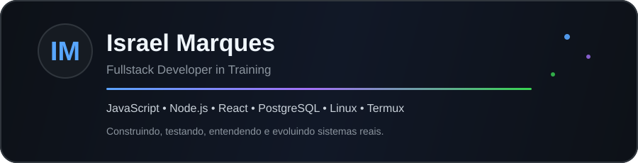

<div align="center">



<br/>

[](https://github.com/israelmarques1024-dotcom)
[](https://karneltermux.vercel.app)

**Construindo projetos reais, entendendo sistemas por dentro e transformando curiosidade em software.**

</div>

---

## 👨‍💻 Sobre mim

Sou desenvolvedor fullstack em formação, com foco no ecossistema **JavaScript / Node.js** e interesse forte em sistemas, automação, Linux e ferramentas para desenvolvedores.

<table>
<tr>
<td width="50%" valign="top">

### 🎯 Foco atual

- APIs REST e back-end
- React + Vite
- PostgreSQL e SQLite
- Linux e Termux
- CLIs e automação
- Arquitetura e observabilidade

</td>
<td width="50%" valign="top">

### 🧠 Como eu aprendo

- construindo projetos reais
- desmontando problemas complexos
- testando hipóteses
- corrigindo até entender a causa
- documentando o que aprendi
- evitando apenas copiar soluções

</td>
</tr>
</table>

---

## 🛠️ Tech Stack

<div align="center">

### Frontend


### Backend & Dados


### Ambiente & Ferramentas


</div>

---

## 📊 GitHub em números

<div align="center">
  
  
</div>

<div align="center">
  <sub>Cards gerados automaticamente e armazenados neste próprio repositório.</sub>
</div>

---

## 🚀 Projetos em destaque

<div align="center">

<a href="https://github.com/israelmarques1024-dotcom/karnel-termux">
  
</a>
<a href="https://github.com/israelmarques1024-dotcom/nearbit">
  
</a>

</div>

<table>
<tr>
<td width="50%" valign="top">

### ⚙️ Karnel Termux

Ecossistema de ferramentas para desenvolvimento no **Termux**, focado em instalação, automação e experiência de desenvolvimento no Android.

**Explora:** CLI · automação · Linux · tooling · integração com ferramentas dev

[](https://github.com/israelmarques1024-dotcom/karnel-termux)
[](https://karneltermux.vercel.app)

</td>
<td width="50%" valign="top">

### 📡 Nearbit

Projeto de comunicação entre dispositivos, explorando mensageria, interfaces web/desktop e comunicação em rede.

**Explora:** networking · mensagens · web · desktop · comunicação entre dispositivos

[](https://github.com/israelmarques1024-dotcom/nearbit)

</td>
</tr>
</table>

---

## 🧭 O que estou explorando agora

```text
Backend & APIs       ██████████  foco alto
Linux & Termux       ██████████  foco alto
Frontend / React     ████████░░  evoluindo
Bancos de dados      ████████░░  evoluindo
Arquitetura          ███████░░░  aprofundando
Automação / CLIs     █████████░  construindo
```

> Não são métricas de proficiência — representam apenas onde estou concentrando meus estudos e projetos atualmente.

---

## ⚡ Meu fluxo

<div align="center">

`entender` → `arquitetar` → `construir` → `testar` → `corrigir` → `documentar` → `evoluir`

</div>

---

## 🔗 Links

<div align="center">

[](https://github.com/israelmarques1024-dotcom)
[](https://karneltermux.vercel.app)
[](https://github.com/israelmarques1024-dotcom/karnel-termux)
[](https://github.com/israelmarques1024-dotcom/nearbit)

</div>

---

<div align="center">

### Curiosidade → conhecimento → sistemas que funcionam.

**Se algum projeto for útil, uma ⭐ ajuda bastante.**

</div>
